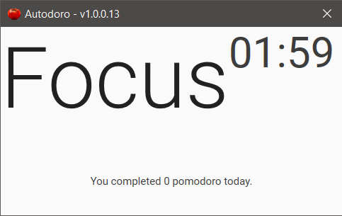

# Autodoro (Automated Pomodoro counter)

{ width="800" height="600" style="display: block; margin: 0 auto" }

Tracks when you are active on your computer and automatically starts/stops pomodoro timer.

 - Breaks are automatically started after 25 minutes of **focus**.
 - If you have been **idled for 12 minutes**, the timer stops.
 - Pomodoro count are **recorded per day**.

## License

Copyright © 2020 Sandae Macalalag
